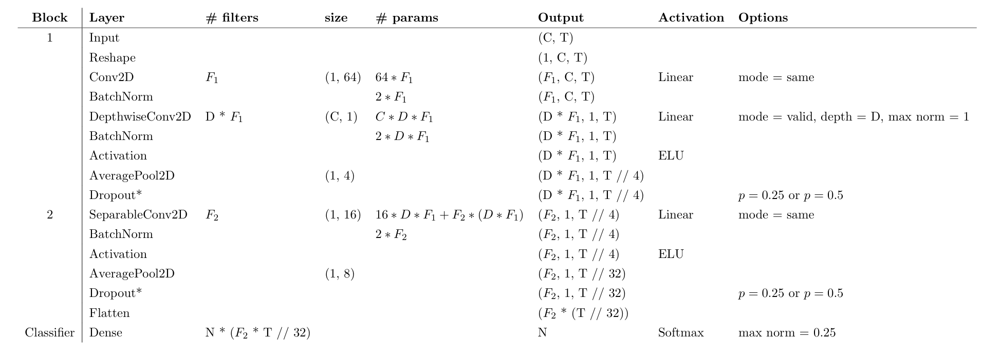
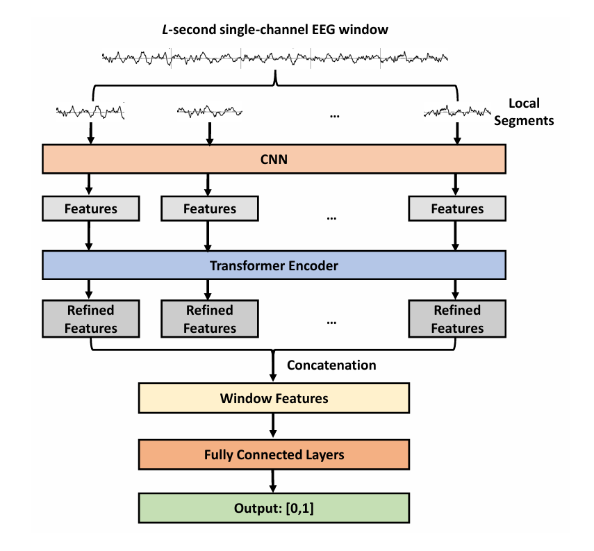

# EEG Classification Baselines

The goal of this project is to establish a set of reproducible baseline results for EEG signal classification.

## Dataset

This project is designed to work with the following EEG datasets.

### *HMC*

<!-- Dataset information -->

In the JSON file, label 0, 1, 2, 3 stands for *Wake*, *NERM1*, *NERM2* and *NERM3* respectively.

We use the EEGs of the first 100 subjects as train set, middle 25 subjects as dev set and last 26 subjects as eval set.

| Split | Wake | NERM1 | NERM2 | NERM3 |
|-|-|-|-|-|
| Train | 47085 | 31632 | 100404 | 51000 |
| Dev | 12558 | 6408 | 23316 | 14883 |
| Eval | 11415 | 8604 | 26529 | 14130 |

### *TUSZ*

<!-- Dataset information -->

In the JSON file, label 0 stands for no seizure shown, 1 for seizure.

| Split | Not seizure | Seizure |
|-|-|-|
| Train | 295320 | 19301 |
| Dev | 82441 | 5707 |
| Eval | 42931 | 3160 |

<!-- Dataset link -->

## Models

### EEGNet

A compact convolutional neural network for EEG-based brain-computer interfaces.

Set the parameters as in the [Paper](https://arxiv.org/pdf/1611.08024).



### CNN+Transformers

A CNN+Transformer architecture is a common baseline that appears in many papers on EEG models, see [Paper](https://arxiv.org/pdf/2208.02405) for detailed structure.

Since the *Segment-level* model in the paper is too complex. We make a change to *Channel-level* model so that it can handle multi-channel data: Apply channel-level convolution for each channel, then concantate them together as the input of the transfomer encoder. 

Below is the structure of the channel-level model.



### LaBraM

See [Github](https://github.com/935963004/LaBraM).

### Qwen-VL

Instead of directly using NumPy arrays as input, some approaches convert EEG signals into images, transforming the task into a computer vision problem. Therefore, fine-tuning an existing vision model is a common approach, like [LLaVA-Med](https://github.com/microsoft/LLaVA-Med). Here, we will evaluate the ability of a base vision model to recognize EEG signals.

We will skip the training stage here. Since we will load the model locally, *make sure you have enough GPU memory!*

To accelerate evaluation, we can provide the model with a specific prompt that restricts the output to the class label, allowing for batch processing of samples.

```python
model = AutoModelForCausalLM.from_pretrained("Qwen/Qwen-VL", device_map="auto", trust_remote_code=True).eval()

image = ... # Assume a TUSE sample
prompt = "Based on the provided EEG, determine if the subject has seizure. If yes, answer 1; otherwise, answer 0. Any other responses are prohibited."

# Support batch input
query = tokenizer.from_list_format([
    {'image': image}, 
    {'text': prompt},
])
inputs = tokenizer(query, return_tensors='pt').to(model.device)
pred = model.generate(**inputs)

# Support batch decode
response = tokenizer.batch_decode(pred.cpu(), skip_special_tokens=True)
```

> More modes to be added...

## Installation and Usage

### Installation

```bash
git clone https://github.com/forLG/EEG-Baseline

conda create -n eeg-baseline
conda activate eeg-baseline

pip install -r requirements.txt
```

### Usage

First, download required dataset *TUSZ* and *HMC*.

<!-- Download link or guide -->

Then, modify the training and evaluation scripts according to your loacl envirenment. Here, take EEGNet as an example. 

- Change the setting in `./eegnet/train.py` and run the training loop. The best model will be saved in `MODEL_SAVE_PATH`.

    ```bash
    python ./eegnet/train.py
    ```
-  Change the setting in `./eegnet/eval.py` and run the evalution loop. The best model you trained last step will be loaded and the evalution result will be dumpped in a JSON file in `RESULTS_SAVE_PATH`.

    ```bash
    python ./eegnet/eval.py
    ```


